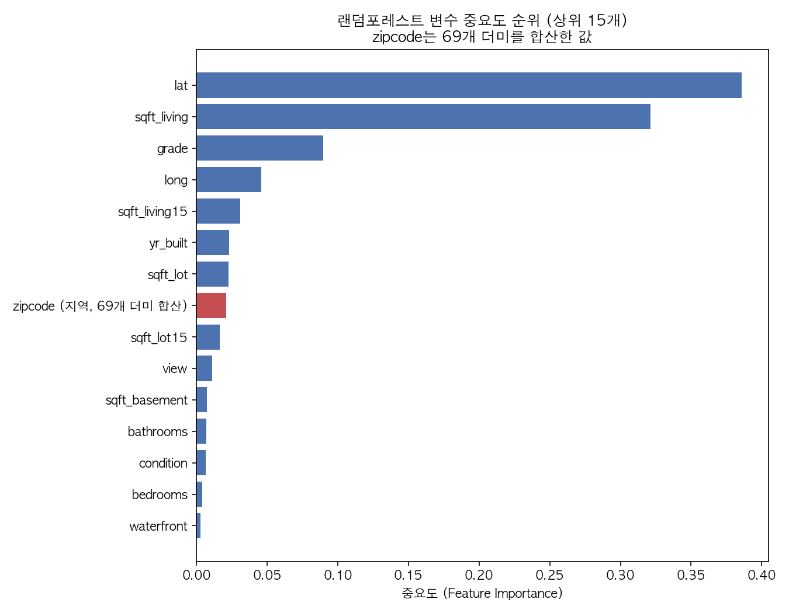
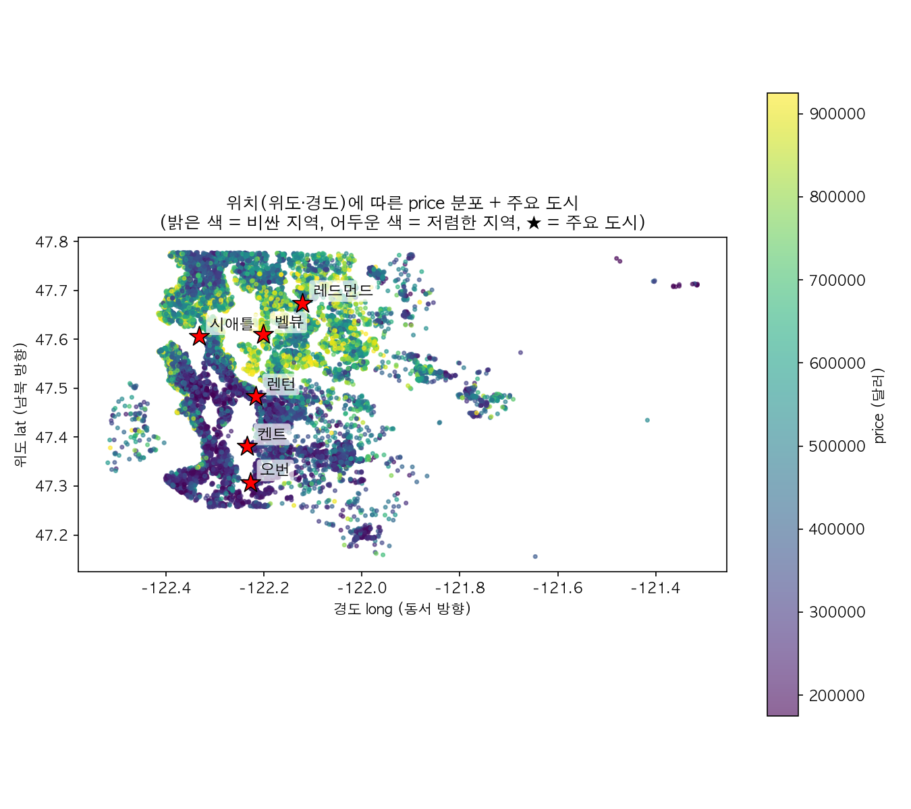

# 킹 카운티 주택 가격 예측

미국 워싱턴주 킹 카운티(King County)의 주택 매매 기록(`kc_house_data.csv`, 21,613건)으로 매매가(`price`)를 예측하는 회귀분석 프로젝트입니다.

- 데이터: 용량 문제로 이 저장소에는 포함하지 않았습니다. 아래 "데이터 출처"에서 받아 `data/raw/kc_house_data.csv`에 넣어주세요.
- 문제 정의 과정: [`docs/problem_definition.md`](docs/problem_definition.md) (v0→v1→v2)
- 작업 전체 기록: [`docs/WORKLOG.md`](docs/WORKLOG.md)
- 결과 리포트: [`docs/REPORT.md`](docs/REPORT.md)
- 결과물(그래프·모델 비교표 등): `outputs/day6/` (`day6`은 수업 6차시를 뜻함)

## 데이터 출처

[King County House Sales Prediction (Kaggle)](https://www.kaggle.com/datasets/harlfoxem/housesalesprediction)

`kc_house_data.csv`를 내려받아 `data/raw/kc_house_data.csv`로 저장한 뒤, 아래 "재현 방법"의 `01_clean_data.py`를 실행하면 `data/processed/kc_house_data_cleaned.csv`가 자동으로 만들어집니다.

## 재현 방법

```bash
python3 -m pip install -r requirements.txt

python3 scripts/01_clean_data.py          # 원본 정제 → data/processed/kc_house_data_cleaned.csv
python3 scripts/02_split_data.py          # 랜덤 분할 + 시간순 분할(train_time/test_time) 생성
python3 scripts/03_baseline.py            # 평균값 기준선(baseline) 계산
python3 scripts/04_train_models.py        # 선형회귀/랜덤포레스트/XGBoost 학습 + 비교표
python3 scripts/05_feature_importance.py  # 랜덤포레스트 변수 중요도 그래프
python3 scripts/06_error_analysis.py      # 예측 오차 상위 5건 분석
python3 scripts/07_price_distribution.py  # price 분포 그래프
python3 scripts/08_question_charts.py     # 문제정의 "확인해 볼 것 3가지" 그래프
python3 scripts/09_relationship_charts.py # price-변수 관계 그래프 3장
python3 scripts/10_geo_price_map.py       # 위치-가격 지도
```

모든 스크립트는 프로젝트 루트에서 실행하는 걸 기준으로 상대 경로를 씁니다. `02_split_data.py`는 랜덤 분할(`train.csv`/`test.csv`, 초기 탐색용)과 시간순 분할(`train_time.csv`/`test_time.csv`)을 둘 다 만들지만, **`04` 이후 모든 스크립트는 시간순 분할을 공식 기준으로 사용합니다** (이유는 [`docs/problem_definition.md`](docs/problem_definition.md) v2 참고).

matplotlib 한글 폰트로 `AppleGothic`(macOS 전용)을 씁니다. 다른 OS에서는 `07`~`10` 스크립트의 `plt.rcParams["font.family"]` 값을 해당 OS에 설치된 한글 폰트로 바꿔야 합니다.

## 핵심 결과

기준선(평균값 예측, RMSE 195,257, 시간순 분할 기준)과 비교해 세 모델 모두 확실히 개선됐습니다. 입력 변수는 `id`/`sqft_above`/`date`/`price`를 제외한 나머지 17개(`zipcode`는 원-핫 인코딩)입니다.

| 모델 | RMSE | 기준선 대비 |
|---|---|---|
| 기준선 (평균값) | 195,257 | - |
| 선형회귀 | 88,477 | 54.7% 감소 |
| XGBoost | 82,574 | 57.7% 감소 |
| **랜덤포레스트 (최고)** | **81,472** | **58.3% 감소** |



가장 중요했던 변수는 `lat`(위도)과 `sqft_living`(실거주 면적)이었습니다.

자세한 내용은 [`docs/REPORT.md`](docs/REPORT.md)를 참고하세요.

## 위치가 가격에 미치는 영향



`lat`(위도)이 왜 중요한 변수인지 지리 지식 없이도 볼 수 있게, 실제 위경도에 집을 점으로 찍고 가격을 색으로 표현했습니다. 시애틀·벨뷰·레드먼드(북쪽, 밝은색)가 켄트·오번(남쪽, 어두운색)보다 뚜렷하게 비쌉니다.

## 이 프로젝트가 첫 번째와 다른 점

[첫 번째 프로젝트(자전거 대여 수요 예측)](https://github.com/heeheej1996-design/bike-share-demand-portfolio)는 강사님이 데이터와 분석 순서를 정해준 프로젝트였습니다. 이번 프로젝트는 데이터 선정, 문제 정의, 전처리 판단을 직접 했습니다.

**문제를 직접 정의했습니다.** 예측해볼 만한 주제 후보 5개(집값, 집 면적, 주변 집 평균 면적, 대지 면적, 지하실 면적)를 직접 뽑고, 그중 결측치가 없고 극단치·0값 문제가 적어 전처리 부담이 적은 **집값(`price`) 예측**을 선택했습니다.

직접 내린 판단 중 대표적인 것 3가지:

1. **가격 100만 달러 이상 매물(전체의 6.9%)을 삭제하기로 결정.** 근거 없이 뺀 게 아니라, 이 매물들을 포함했을 때와 제외했을 때 예측 오차(MAE)를 직접 비교해서 최대 41% 차이가 난다는 걸 확인한 뒤 삭제를 결정했습니다.
2. **훈련/평가 데이터를 무작위로 나누던 것을 날짜순 분할로 바꿈.** 데이터에 거래 날짜 컬럼이 있다는 걸 다시 확인하면서, 무작위 분할이 "미래 데이터를 보고 과거를 맞히는" 문제를 일으킬 수 있다고 판단해 날짜순 정렬 후 앞 80%/뒤 20%로 나누는 방식으로 바꾸고, 성공 기준(기준선 RMSE)도 그에 맞춰 다시 계산했습니다.
3. **원인을 다 밝히지 못한 값도 소수라면 삭제로 판단.** 방(`bedrooms`) 또는 화장실(`bathrooms`)이 0개인 집 16건은 왜 그런 값이 있는지 끝내 확인하지 못했지만, 전체의 0.1%도 안 되는 소수라 삭제해도 손실이 적다고 판단해 제거했습니다.

## 사용한 기술

Python, pandas, scikit-learn (LinearRegression, RandomForestRegressor), XGBoost, matplotlib
